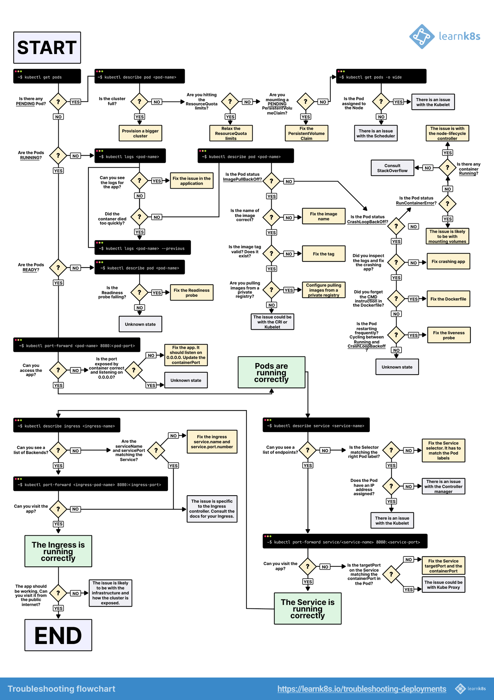

# k8s

In this repo, we will see all the key features of k8s
- pod creation (deployment, stateful set, etc)
- service
- ingress
- job/cron-job
- secret/configMap
- CRD (argo workflow/CD)

## k8s cli cheat sheet

You can find some examples of useful command:
- kubectl: [kube_docs](docs/kube_command)
- helm: [helm_docs](docs/helm_command)
- argo-workflow: [argo_workflow_docs](docs/argo-workflow)

## k8s deployment debug

Below is a workflow that helps you to identify issues and debug your app

